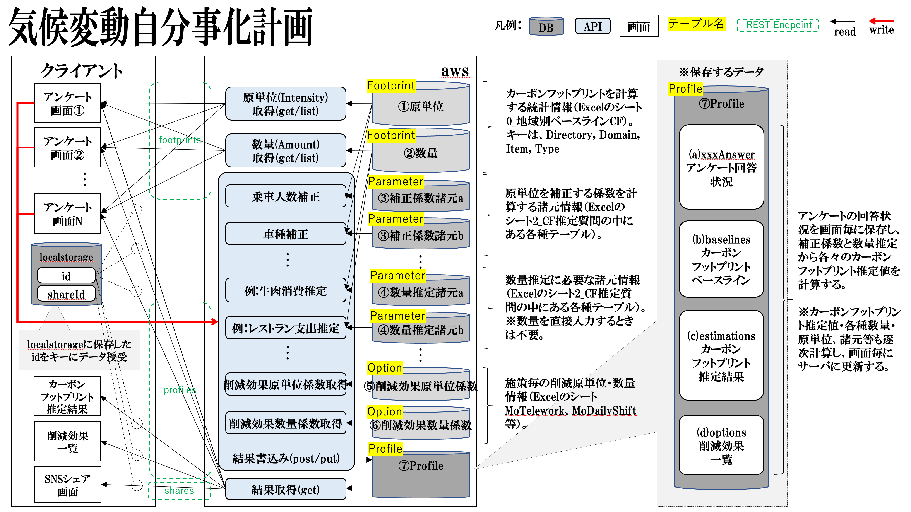

# Contributor Guide

## アーキテクチャ

### 全体構成



### バックエンド実装方案選定の考え方

#### 経緯

- 様々な主体からカーボンフットプリントの計算に対しての需要があり、それをオープンソース化したい。
- 上記を実現する手段として、計算関数を Code for Japan がホストする API にして公開し、開発者が使いやすい状態にする方案を採用。
- また、API 単体ではの使い方のイメージがつかず広めていくことは難しいため、個人のカーボンフットプリントと削減施策を算出する「じぶんごとプラネット」としてユースケースも同時に作る。

#### 実装方案選定の前提条件

- バックエンド環境は aws を採用。
- 計算関数は、基本的にはテーブルルックアップ主体のロジックで、負荷の高い計算は行わないことから lambda で実装する方案を採用。
- データベースはキー読み、JSON の保存ができればよく、複雑なデータの結合は必要ないため dynamodb を採用。
- API は初期バージョンでは REST、将来的には GraphQL もサポートしたい。

上記の前提で開発を効率的に進めるため、本プロジェクトでは aws CDK を採用。

## バックエンドの開発

### 前提条件

開発には、node, yarn が必要です。node, yarn は最新バージョンをインストールして下さい。インストールされているバージョンは以下で確認できます。

```bash
node -v; yarn -v; aws --version
# 以下は実行結果の例
v20.x # Node.jsのバージョン
1.22.19 # yarnのバージョン、npmでなくyarnを使って下さい。
aws-cli/2.7.7 Python/3.9.11 Darwin/21.5.0 exe/x86_64 prompt/off # aws cliのバージョン
```

### ローカルのでの開発方法

#### 環境構築

本プロジェクトはaws CDKを利用しています。本リポジトリを fork して、開発環境に pull した後、以下のコマンドでaws環境を構築してください。
localでは localstack およびdockerを使用しています。作業後はdockerを停止することを忘れないでください

```bash
# build 方法
sh build.sh

# 停止方法
docker compose down
```
全てのコマンドが完了後以下のようにApiGatewayの宛先が表示されるので、そこからアクセス

```shell
✅  localJibungotoPlanetApiGatewayStack

✨  Deployment time: 5.21s

Outputs:
localJibungotoPlanetApiGatewayStack.localJibungotoPlanetapiGatewayEndpointEA44D72E = https://5e0co6qiao.execute-api.localhost.localstack.cloud:4566/local/
Stack ARN:
arn:aws:cloudformation:ap-northeast-1:000000000000:stack/localJibungotoPlanetApiGatewayStack/55405aaa

# この場合は以下の情報を、フロントのNEXT_PUBLIC_API_URLに設定する
https://5e0co6qiao.execute-api.localhost.localstack.cloud:4566/local/
````

#### テストツール

テストの効率化のため、Excel からテストケース、期待する結果を読み込んで検証する仕組みを構築しました。`src/tests/xxx-xxx-test-cases.xlsx`の answers シートにテストケース（xxxAnswer の値を設定）を作成し、case 名と同じ名前のシートに期待する結果を記入します。一行目が黄色の列のデータを取り込み、テストを実施します。

## バックエンドの運用方法

### CDKの環境

以下の３つの環境を用意していますが、運用においては後述する課題があります。

|環境|名前|用途|
|---|---|---|
|dev|開発環境|主にバックエンドの開発用に利用|
|prd|本番環境|本番で利用|

### データの更新方法

Footprint, Parameter, Option のデータは data/aws フォルダの `load-dev.sh`, `load-prd.sh` スクリプトを実行することで各環境のデータを更新できます。各テーブルのデータを全削除して再ロードします。左記のスクリプトを実行するためには、data/aws/config.ini に AWS_ACCESS_KEY_ID, AWS_SECRET_KEY, REGION を設定する必要があります。data/aws/sample.config.ini にサンプルの設定を記載していますでコピーして書き換えて下さい。

各々のスクリプトでは、`data/footprint.csv`, `data/parameter.csv`, `data/option.csv` をテーブルにロードしますが、これらの csv ファイルは別途管理する Excel ファイルから生成されます。注意事項としては、

- ロードに使っている dynamodb-csv が対応する文字コードは UTF8 になります。Excel が出力する UTF8 は BOM 付き UTF8 で、dynamodb-csv では読めません。
- 上記から、parameter.csv ファイルを生成する際は、日本語が含まれていますので一旦 Shift JIS の csv ファイルで保存してもらい、テキストエディタ等 UTF8 に変換して下さい。

### 特記事項

#### dynamodb のテーブル名

REST で同じ dynamodb を参照するため、CDK が自動生成する dynamodb のテーブルを REST から参照・更新する構成にしています。

| 環境  | テーブル名                       | 説明                        |
|-----|-----------------------------|---------------------------|
| dev | devJibungotoPlanetfootprint | フットプリントの数量、原単位の全国標準情報     |
| dev | devJibungotoPlanetparameter | 個人のフットプリントの計算に必要なパラメーター情報 |
| dev | devJibungotoPlanetoption    | 削減施策を計算するためのパラメータ情報       |
| dev | devJibungotoPlanetprofile   | 個人のフットプリントの計算結果を保存        |
| prd | prdJibungotoPlanetfootprint | フットプリントの数量、原単位の全国標準情報     |
| prd | prdJibungotoPlanetparameter | 個人のフットプリントの計算に必要なパラメーター情報 |
| prd | prdJibungotoPlanetoption    | 削減施策を計算するためのパラメータ情報       |
| prd | prdJibungotoPlanetprofile   | 個人のフットプリントの計算結果を保存        |

## 残課題

- parameter テーブル、option テーブルについては更新頻度も少なく、データとして他の用途に流用することもないので、json に変換して、lambda のプログラムの一部として読みこむ方案も考えられる。これにより dynamodb へのアクセスが減りレスポンスも向上する。
